# WEB STACK IMPLEMENTATION (LAMP STACK) IN AWS

STEP 0: Preparing prerequisites

> Connect to AWS EC2 instance and Update Ubuntu packages
>
> `sudo apt update`

STEP 1: Installing Apache2 and updating the firewall

>Install Apache server and configure
>
> `sudo apt install apache2`
>
>`sudo systemctl status apache2`

>Check if Apache server can be accessed via Ubuntu shell
>
>`curl http://localhost:80`

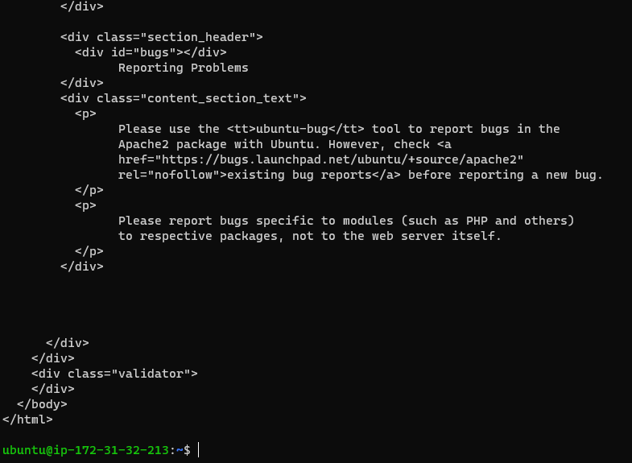

>Confirm Apache server installation
>
>`curl -s http://169.254.169.254/latest/meta-data/public-ipv4`

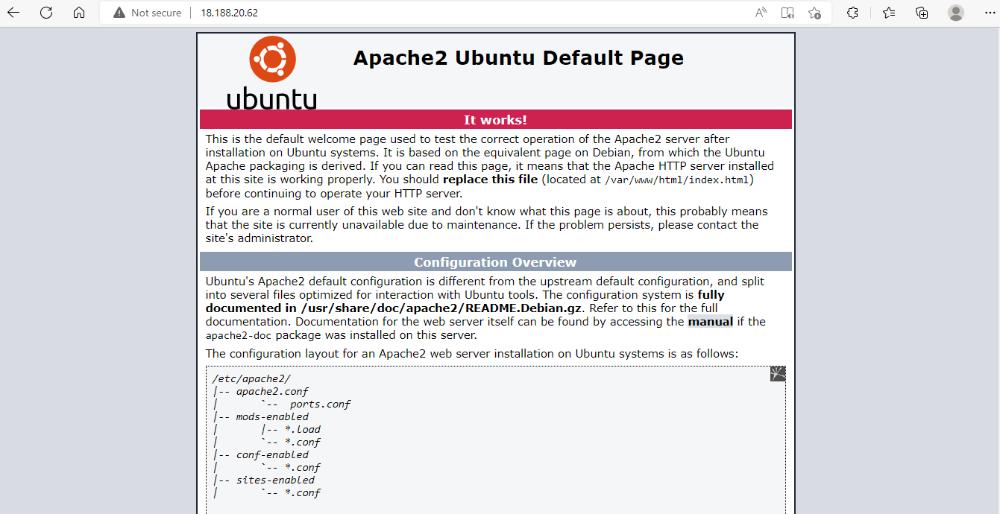

>Apache server successfully installed and configured.

STEP 2: Installing MYSQL

>Install this software
>
>`sudo apt install mysql-server`
>
>log in to the MySQL console
>
>`sudo mysql`

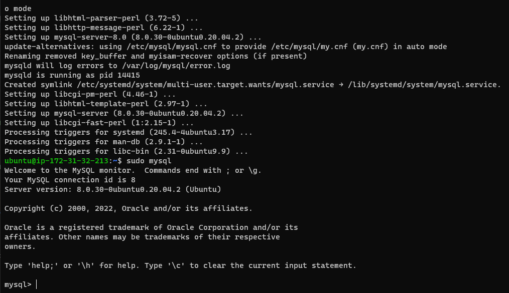
>Exit and start the interactive script to configure the VALIDATE PASSWORD PLUGIN
>
>`exit`
>
>`sudo mysql_secure_installation`
>
>Test the secure log in to the MySQL console
>
>`sudo mysql -p`

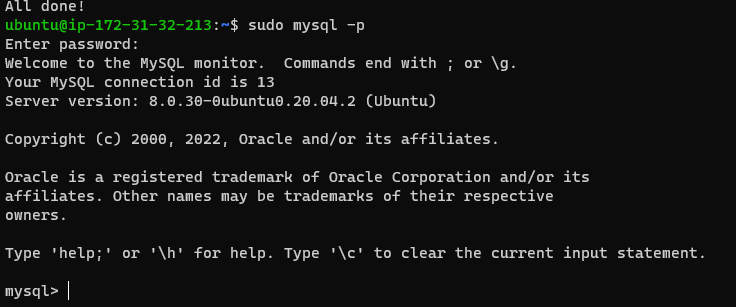

>Successfully installed mysql with secure login credentials.

STEP 3: Installing PHP

>Install 3 PHP packages at once
>
>`sudo apt install php libapache2-mod-php php-mysql`
>
>Confirm PHP version installed
>
>`php -v`

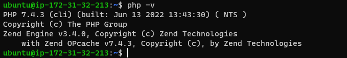

>LAMP stack is completely installed and fully operational.

STEP 4: Creating a virtual host for your website using Apache

>Set up a domain called "projectlamp" by first creating the directory
>
>`sudo mkdir /var/www/projectlamp`

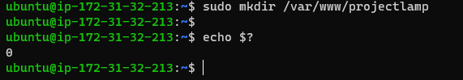

>Assign ownership of the directory with your current system user
>
>`sudo chown -R $USER:$USER /var/www/projectlamp`

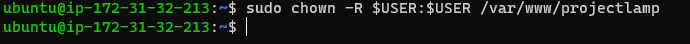

>Create and open a new configuration file in Apache’s "sites-available" directory
>
>`sudo vi /etc/apache2/sites-available/projectlamp.conf`

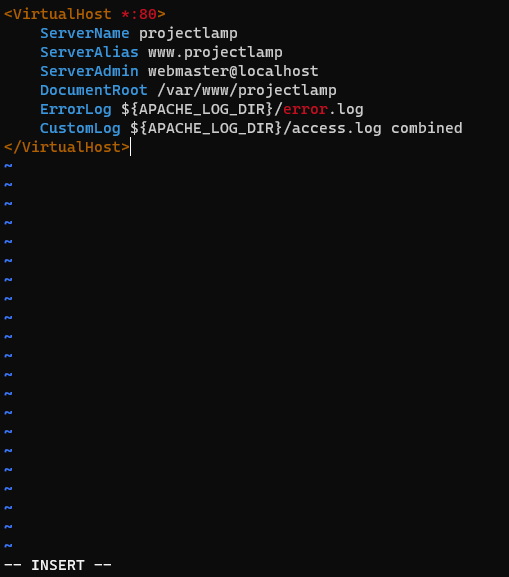

>View the "sites-available" directory
>
>`sudo ls /etc/apache2/sites-available`

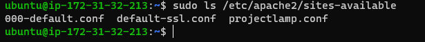

>Enable the new virtual host
>
>`sudo a2ensite projectlamp`
>
>To disable Apache’s default website
>
>`sudo a2dissite 000-default`
>
>To make sure the configuration file doesn’t contain syntax errors
>
>`sudo apache2ctl configtest`
>
>To effect these changes, reload Apache
>
>`sudo systemctl reload apache2`

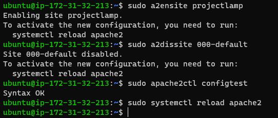

>Create an index.html file in web root location to test if the virtual host works
>
>`sudo echo 'Hello LAMP from hostname' $(curl -s http://169.254.169.254/latest/meta-data/public-hostname) 'with public IP' $(curl -s http://169.254.169.254/latest/meta-data/public-ipv4) > /var/www/projectlamp/index.html`

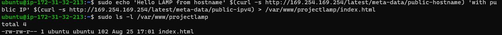

>Open the website URL in the browser using the IP address:
>
>`http://<Public-IP-Address>:80`

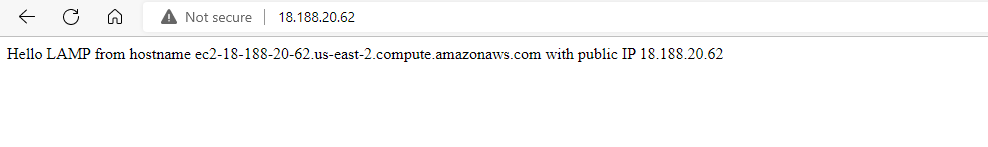

STEP 5: Enable PHP on the website

>`sudo vim /etc/apache2/mods-enabled/dir.conf`
>
>reload the server
>
>`sudo systemctl reload apache2`
>
>Create a new file named "index.php" inside the custom web root folder:
>
>`vim /var/www/projectlamp/index.php`

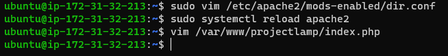

>Save, close and refresh page.

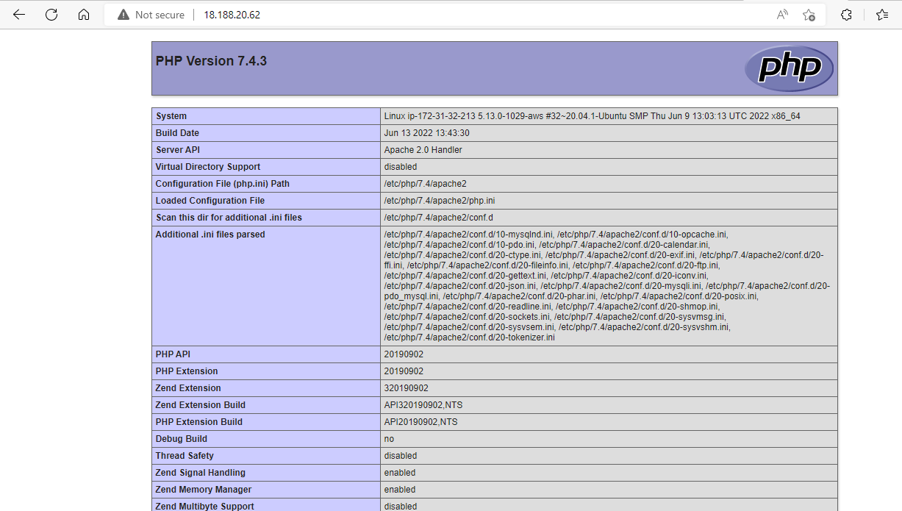

>PHP installation is working as expected.
>Remove the PHP file to protect sensitive information about the PHP environment and the Ubuntu server
>
>`sudo rm /var/www/projectlamp/index.php`
